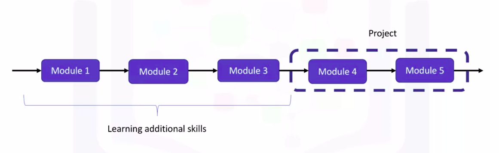
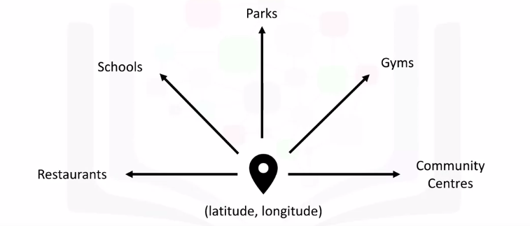

Applied Data Science Capstone
=============================

by IBM

# Module 1

#
## Title: Introduction

## Introduction to Capstone Project

### Introduction

* In this capstone project, I hope to equip you with the necessary skills to do so, and not only that, but at the end you will have the opportunity to be creative and come up with your own idea or problem to solve using location data
	* For example,
		1. you can choose to compare different neighborhoods in terms of a service
		1. search for potential explanation of why a neighborhood is popular
		1. the cause of complaints in another neighborhood
		1. anything else related to neighborhoods
* Hence the name of the capstone project will be __the Battle of the Neighborhoods__
				

				  
				

* So what you will learn to do is given a city like the City of Toronto
	1. you will segment it into different neighborhoods using the geographical coordinates of the center of each neighborhood
	1. then using a combination of location data and machine learning
		* you will group the neighbourhoods into clusters like this
				

				  
				

* __Summary__
	* this capstone course will consist of five modules
		* In the first three modules, I hope to equip you with all the additional skills you need so that in the remaining two modules you will be able to work on something exciting of your own creativity
		* You will be required to leverage location data to solve a problem or to get deeper insights into a neighborhood's reputation
				

				  
				

## Location Data Providers

### Location Data Providers

* __Location data__ is data describing places and venues, such as their geographical location, their category, working hours, full address, and so on, such that for a given location given in the form of its geographical coordinates (or latitude and longitude values) one is able to determine what types of venues exist within a defined radius from that location
	* So, for a given location you will be able to tell if restaurants for example, exist nearby, or if schools, or parks, or gyms, or community centres exist nearby
	* Also, how many of each category exist and how each surrounding venue is reviewed by other people
	* So this is what's referred to as location data
				

				  
				

* Now among the many location data providers are
	1. Foursquare
	1. Google Places
	1. Yelp
				

				  
				

* Location data providers will differ in a number of features
	1. __Rate Limits__
		* which essentially means how many API calls you can make in a defined time frame such as calls per hour or calls per day
	1. __Cost__
		* which is how much it would cost you to use their API to fetch location data
	1. __Coverage__
		* which is geospatial coverage. In other words, how many countries or geographical locations the location data set covers
	1. __Accuracy__
		* so how accurate is the location data provided by each provider? Especially those that crowd source their data
	1. __Update Frequency__
		* which means how frequently the location data gets updated
		* you will find some providers like Foursquare for example, who update their data continuously, whereas other providers would update their data either daily or weekly depending on their location data
* So, these are some of the features to keep in mind if in the future you find yourself requiring to use location data to solve a problem
