Applied Data Science Capstone
=============================

by IBM

# Module 2

#
## Title: Foursquare API

## Introduction to Foursquare

### Introduction to Foursquare

* What is Foursquare
	* Foursquare is a technology company that built a massive dataset of location data
	* What is interesting about Foursquare is that they were very smart about building their dataset
		* They actually crowd-sourced their data and had people use their app to build their dataset and add venues and complete any missing information they had in their dataset
	* Currently its location data is the most comprehensive out there, and quite accurate that it powers location data for many popular services like __Apple Maps__, __Uber__, __Snapchat__, __Twitter__ and many others, and is currently being used by over 100,000 developers, and this number is only growing
	* To try out Foursquare you can either use their phone app or their online website, [Foursquare](www.foursquare.com)
				

				  <a href="javascript:void(0)" rel="noopener">
					 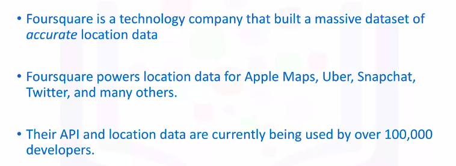</a>
				

	* Sample result for "Coffee Shop" near "102 North End Ave NY" search string
				

				  <a href="javascript:void(0)" rel="noopener">
					 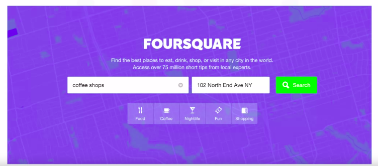</a>
				

				

				  
				

		* On the left you see the name, the category, and the address of each of the venues serving coffee around the Conrad Hotel
		* On the right side, you see a map of the venues in the list on the left
		* According to the map, coffee shop number 16 is the closest, and is called Kaffe 1668, and has an average rating of 9.0
			* Sample Page pertaining to Kaffe 1668 on Foursquare
					

					  
					

				* On this page you can find all information in the Foursquare dataset about Kaffe 1668
				* This includes its name, full address, working hours, menu, and tips and images that users have posted about the shop and any of its drinks
			* You can check out the tips posted, so if you click the tips tab, it will take you to the tips section on this page
					

					  <a href="javascript:void(0)" rel="noopener">
						 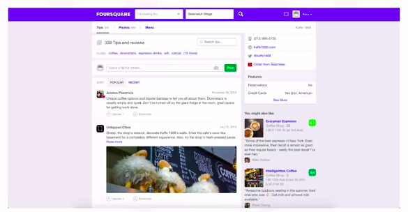</a>
					

				* In this section, you can see how many tips users submitted about Kaffe 1668. We can see that there are 338 tips and reviews submitted
				* The first review is by a user named Jessica and her tip was upvoted by another user
					* The review says
						* "Unique coffee options and hipster baristas to tell you all about them. Downstairs is usually empty and quiet. Don't be turned off by the giant fridge in the room, great space for getting work done."
							

							  
							

				* If you click on user's name, you'll be redirected to his/her page on Foursquare
					* This is the page of Jessica on Foursquare. Here you can see that she is a very active Foursquare user
					* She actually posted 269 other tips and reviews, and has 38 followers, and is following 36 users
					* On her page you can also see what places she's been to, and what images or tips she posted about different places
							

							  <a href="javascript:void(0)" rel="noopener">
								 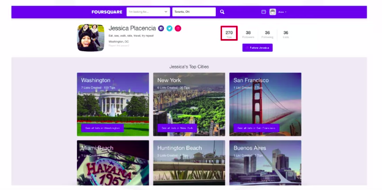</a>
							

## Getting Foursquare API Credentials

### Signing up for a Foursquare Developer Account

* To retrieve data from the Foursquare database, we need to create a Developer Account
* URL : [Foursquare](www.foursquare.com)
* Developer Page URL : [Developer Page](https://developer.foursquare.com/)
* FOLLOW REGULAR **SIGN UP** PROCESS TO CREATE DEVELOPER ACCOUNT ON FOURSQUARE DEVELOPER WEBSITE
* When you create a developer account, the default type is the sandbox account, with 950 regular calls per day and 50 premium calls per day, and you can retrieve only one photo and one tip per venue
* Once the Developer Account is CREATED then
	1. Click on create a new app
		* Let's name it coursera-capstone-project and give it the URL www.courseracapstoneproject.com
		* __NOTE :__ Normally, if you're leveraging the Foursquare data in a real app that you're building, then you would type it here, but since we're not building any app then it doesn't really matter what URL we use
	1. Select Account Tier
		* in case you're not very happy with the features you get with the default sandbox account
		* Foursquare now has three developer verified account tiers
		* Types of Tiers
			* Personal Account (Free)
				* In the personal account which is still free, and with it you get 99,500 regular calls and 500 premium calls
				* That is actually 100 times more calls than the default sandbox account
				* You'll also get access to over 105 million venues or points of interest, but you still only get two photos and two tips per venue, which is just one more photo and tip compared to the sandbox account
				* You will need to provide your credit card information, but it won't be charged and will only be used for verification purposes
			* Companies Account - NOT FOR US (not related to this course)
			* Enterprise Account - NOT FOR US (not related to this course)
							

							  <a href="javascript:void(0)" rel="noopener">
								 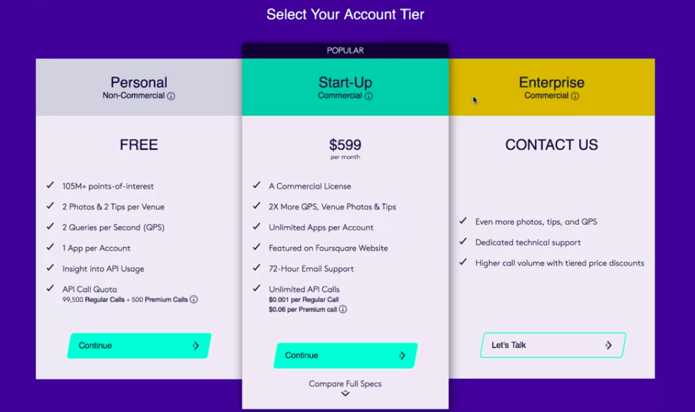</a>
							

* __IMPORTANT URL__ : [ENDPOINT API DOCUMENTATION](https://developer.foursquare.com/docs/places-api/endpoints/)

## Using Foursquare API

### Foursquare - Search

* Communicating with the Foursquare database is really very easy, all thanks to their RESTful API
* You simply create a uniform resource identifier, or URI, and you append it with extra parameters depending on the data that you are seeking from the database
* Any call request you make is composed of, we can call this base URI, which is `api.foursquare.com/v2`, and you can request data about venues, users, or tips
* But, every time you make a call request, you have to pass your developer account credentials, which are your __Client ID__ and __Client Secret__ as well as what is called the __version of the API__, which is simply a __date__
							

							  <a href="javascript:void(0)" rel="noopener">
								 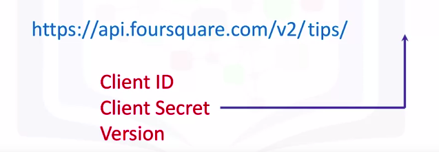</a>
							

* It is designed to give developers the freedom to adapt to Foursquare API changes on their own schedule
	* In other words, you request the data to be returned to you in the format that was the latest up to the date defined by the version
* To search "Coffee Shop" near "102 North End Ave NY" search string using API calls
	* You simply create a URI starting with the base URI, and since you're searching for venues, you use the venues group
		* And remember you always have to pass your Foursquare credentials along with the version of the API
	*  Again because we're searching for a particular type of venues, we use the search endpoint and pass the address of the Conrad Hotel as its latitude and longitude coordinates along with the search query for coffee shops
	* This completes our URI, so we make the call to the database, and in return we get a JSON file of the venues that match our query
							

							  
							

							

							  <a href="javascript:void(0)" rel="noopener">
								 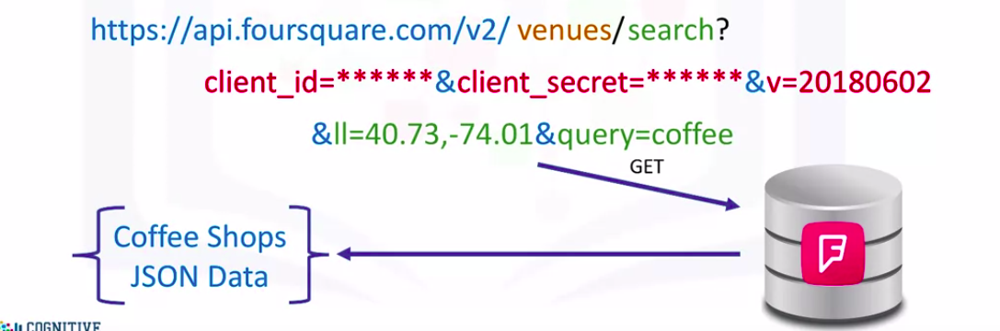</a>
							

				* Remember, this is a regular call and with a personal developer account, we can make up to 99,500 similar calls
* __Venue Data__
	* For each venue, we get mostly its name, unique ID, location, and category
	* Each venue added to the database is assigned a unique ID
							

							  
							

* __Explore a Particular Venue__
	* it's only a matter of creating a URI with all the correct parameters
	* In this case, we're still dealing with venues, so we append the base URI with the venues group along with our credentials and the API version and then, we simply add Kaffe 166'0s unique ID to the URI
							

							  
							

			* We make the call to the Foursquare database and in return, we receive a JSON file containing all the information the database has about Kaffe 1668
			* Actually with a personal account, we only get two tips and photos per venue and not the entire list of tips
			* Remember, that this type of call is premium so with a personal account we can only make 500 similar calls per day
							

							  <a href="javascript:void(0)" rel="noopener">
								 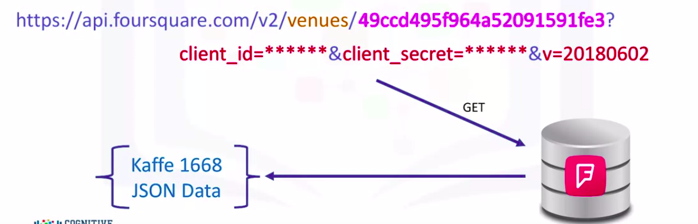</a>
							

			* When we run this query for any venue, we mostly get the venue's name, URL or website if they have an online presence, unique ID again, average rating, location, contact information,menu, and statistics in terms of the number of check-ins, and finally, tips posted about the venue
* __Getting Tips About a Venue__
	* You build the same exact URI as the one you built to learn more about the venue itself, but then you append the unique ID with the tips endpoint
	* Then you proceed as usual; you make the call to the database and in return you get a JSON file with only two tips since we have a personal account
	* Remember that with premium calls you're limited to 500 calls per day
							

							  
							

* __Learn About a Specific User__
	* It's basically the same concept as querying for venues except that instead of using the venues group we use the users group
	* Along with our credentials and the API version, we append the user's group with the unique ID of the user
	* Just like venues, also each Foursquare user is assigned a unique ID, which is essentially used to retrieve all the information pertaining to them
	* Now calls made to retrieve information about users are regular calls, so with a personal account we can make up to 99,500 similar calls per day
	* The database returns a JSON file containing all the data it has about the user 
							

							  <a href="javascript:void(0)" rel="noopener">
								 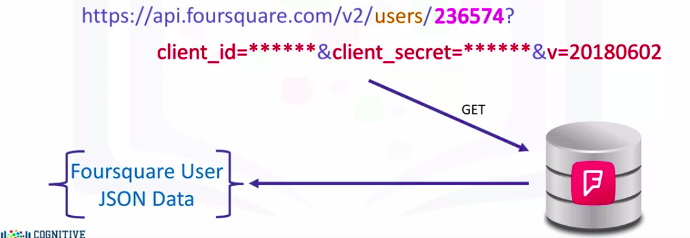</a>
							

	*  For each user, we mostly get their first and last name, their gender, contact information, unique ID, any Foursquare friends they have, and their tips
							

							  
							

### Foursquare - Explore and Other Queries

* __Explore Venues__
	* How do we find the popular spots around the Conrad Hotel
		* Well we use the venues group but we use the explore endpoint instead of the search endpoint, and we pass the latitude and the longitude coordinates of the Conrad Hotel along with our credentials
		* Then we make the call to the database, and in return we get a list of the popular spots around the Conrad Hotel
							

							  <a href="javascript:void(0)" rel="noopener">
								 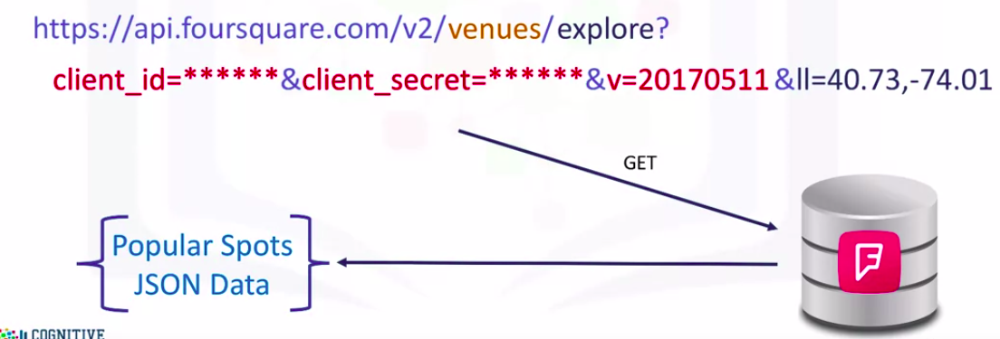</a>
							

		* Just like with the search endpoint, for each venue we get mostly its name, unique ID, location, and category
							

							  
							

* __Explore Trending Venues__
	* Another cool thing you can do with the Foursquare API is getting trending venues nearby
	* These are venues that have the highest foot traffic when the call to the database is made
	* Therefore, the results vary depending on when the call is made
		* So in the morning, you might find that trending venues are coffee shops or office spaces whereas in the evening trending venues can be malls, museums or parks
	* To get the trending venues, you simply use the trending endpoint along with the credentials and the latitude and the longitude coordinates of the place of interest
	* You make the call to the database and you get a JSON file of the trending venues that are nearby
							

							  <a href="javascript:void(0)" rel="noopener">
								 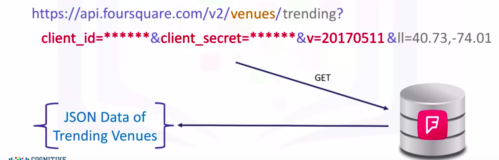</a>
							

	* In the JSON file, for each trending venue, we get mostly its name, unique ID, location, and category
							

							  
							

