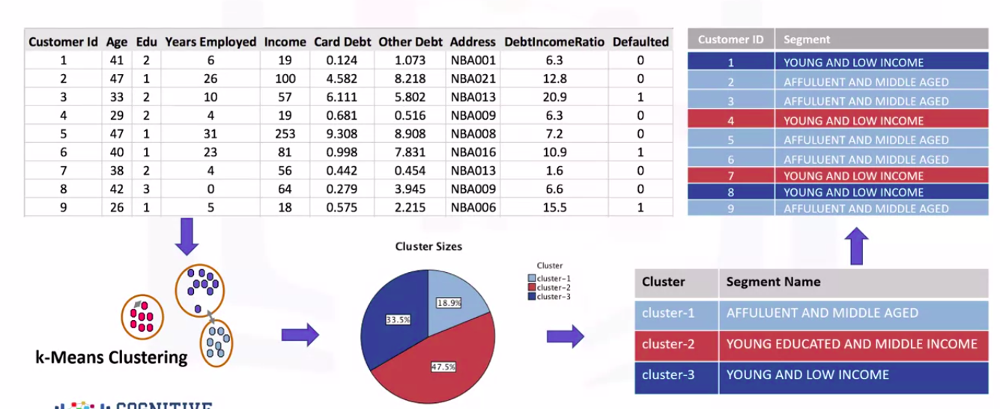
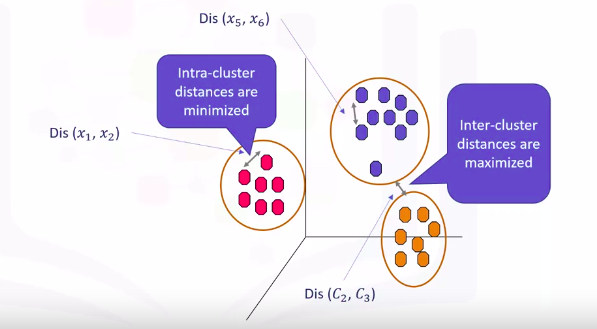
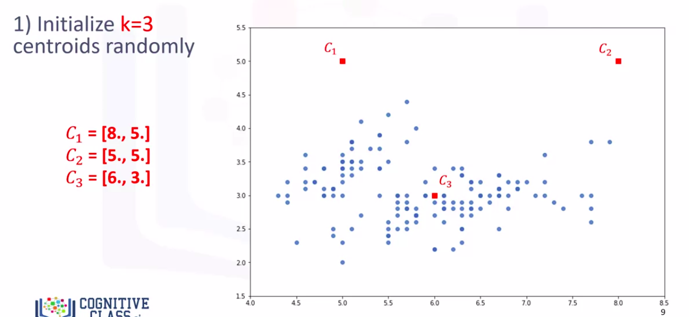
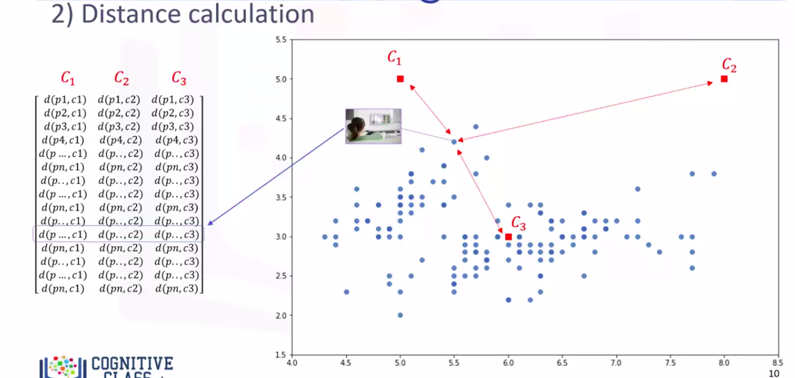
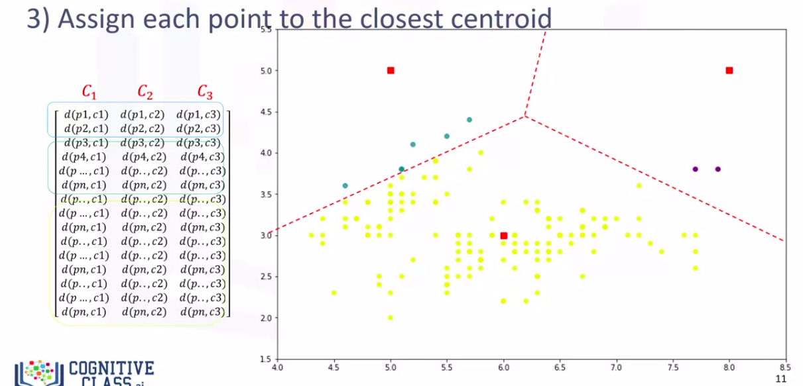
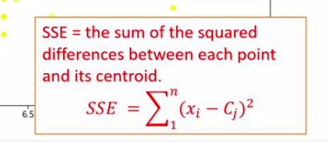
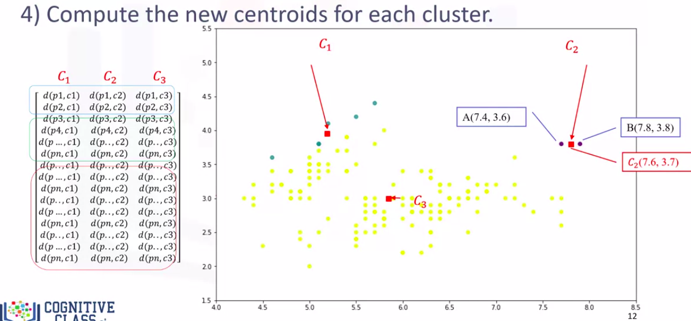

Applied Data Science Capstone
=============================

by IBM

# Module 3

#
## Title: Neighborhood Segmentation and Clustering

## Clustering

### k-means Clustering

* k-means Clustering dataset and sample clusters
							

							  
							

* __Customer segmentation__ is the practice of partitioning a customer base into groups of individuals that have similar characteristics
	* One of the algorithms that can be used for customer segmentation is K-means clustering
* __k-means__ can group data only __unsupervised__ based on the __similarity__ of customers to each other							
* There are various __types__ of __clustering algorithms__ such as 
	1. __Partitioning__
	1. __Hierarchical__
	1. __Density Based Clustering__
* __k-means__ is a type of __partitioning clustering__
	* That is, it divides the data into k non-overlapping subsets or clusters without any cluster internal structure or labels
	* This means, it's an __unsupervised algorithm__
* Objects within a cluster are very similar, and objects across different clusters are very different or dissimilar
* For using K-means, we have to find similar samples
* __Key questions__ when implementing k-means Clustering Algorithm
	1. How can we find the similarity of samples in clustering?
	1. How do we measure how similar two customers are with regard to their demographics?
* Though the objective of K-means is to form clusters in such a way that similar samples go into a cluster and dissimilar samples fall into different clusters
	* It can be shown that instead of a similarity metric, we can use dissimilarity metrics
		* In other words, conventionally, the distance of samples from each other is used to shape the clusters
	* So, we can say, K-means tries to __minimize__ the __intra-cluster distances__ and __maximize__ the __inter-cluster distances__
							

							  
							

	* How can we calculate the dissimilarity or distance of two cases such as two customers?
		* Assume that we have two customers. We'll call them customer one and two
		* Let's also assume that we have only one feature for each of these two customers and that feature is age
		* We can easily use a specific type of __Minkowski distance__ to calculate the distance of these two customers
			* Indeed, it is the __euclidean distance__
							

							  
							

	* If in case we have more than one feature
		* For example, if we have income and age for each customer, we can still use the same formula but this time in a two-dimensional space
							

							  
							

	* We can use the same distance matrix for multidimensional vectors
		* Of course, we have to normalize our feature set to get the accurate dissimilarity measure
		* There are other dissimilarity measures as well that can be used for this purpose, but it is highly dependent on datatype and also the domain that clustering is done for it
			* For example, you may use __euclidean distance__, __cosine similarity__, __average distance__, etc
* __How k-means Clustering works__
	* For the sake of simplicity, let's assume that our dataset has only two features, the age and income of customers
		* This means, it's a two dimensional space
	* We can show the distribution of customers using a scatter plot
		* The Y-axis indicates age, and the X-axis shows income of the customers
	* We try to cluster the customer dataset into distinct groups or clusters based on these two dimensions
							

							  
							

	* Steps for k-means Clustering
		1. __Initialization__
			* In the first step, we should determine the number of clusters
			* The __key concept__ of the K-means algorithm is that, it randomly picks a center point for each cluster
				* It means, we must initialize k which represents number of clusters
				* Essentially, determining the number of clusters in a dataset or K is a hard problem in K-means
			* For now, let's put K equals three here for our sample dataset
				* It is like we have three representative points for our clusters
			* These three data points are called __centroids__ of clusters and should be of same feature size of our customer feature set
			* There are two approaches to choose these centroids
				1. One, we can randomly choose three observations out of the dataset and use these observations as the initial means
				1. Two, we can create three random points as centroids of the clusters which is our choice that is shown in the plot(below) with red color
								

								  
								

		1. __Distance Calculation__
			* After the initialization step, which was defining the centroid of each cluster, we have to assign each customer to the closest center
				* For this purpose, we have to calculate the distance of each data point or in our case each customer from the centroid points
			* Depending on the nature of the data and the purpose for which clustering is being used, different measures of distance may be used to place items into clusters
			* Therefore, you will form a matrix where each row represents the distance of a customer from each centroid
				* It is called the __distance matrix__
								

								  
								

		1. __Assign Each point to the Closest Centroid__
			* The __main objective__ of __k-means clustering__ is to __minimize__ the __distance__ of data points from the centroid of __it's cluster__ and __maximize__ the __distance__ from __other cluster__ centroids
			* So, in this step, we have to find the closest centroid to each data point
			* We can use the distance matrix to find the nearest centroid to data points
			* Finding the closest centroid for each data point, we assign each data point to that cluster
				* In other words, all the customers will fall to a cluster based on their distance from centroids
				* We can easily say that it does not result in good clusters because the centroids were chosen randomly from the first
								

								  
								

				* Indeed the model would have a high error
					* Here, error is the total distance of each point from its centroid
					* It can be shown as within-cluster sum of squares error
					* Intuitively, we try to reduce this error
						* It means we should shape clusters in such a way that the total distance of all members of a cluster from its centroid be minimized
								

								  
								

		1. __Compute the new cetroids for each cluster__
			* In the next step, each cluster center will be updated to be the mean for data points in its cluster
			* Indeed each centroid moves according to their cluster members
				* In other words, the centroid of each of the three clusters becomes the new mean
			* For example
				* if point A coordination is 7.4 and 3.6 and point B features are 7.8 and 3.8, the new centroid of this cluster with two points, would be the average of them, which is 7.6 and 3.7
								

								  
								

			* Now, we have new centroids
			* Once again, we will have to calculate the distance of all points from the new centroids
			* The points are re-clustered and the centroids move again
			* __This continues until the centroids no longer move__
			* __Note__ that whenever a centroid moves, each points distance to the centroid needs to be measured again
* __k-means algorithm__ is an __iterative__ algorithm, and we have to repeat steps two to four until the __algorithm converges__
* In __each iteration__, it will move the centroids, calculate the distances from new centroids, and assign data points to the nearest centroid
	* It results in the clusters with minimum error or the most dense clusters
* However, as it is a __Heuristic Algorithm__, there is no guarantee that it will converge to the global optimum, and the result may depend on the initial clusters
	* It means, this algorithm is guaranteed to converge to a result, but the result may be a local optimum i.e. not necessarily the best possible outcome
	* __To solve this problem__, it is common to run the whole process multiple times with different starting conditions
		* This means with randomized starting centroids, it may give a better outcome, and as the algorithm is usually very fast, it wouldn't be any problem to run it multiple times
								

								  
								

> Indeed, the similarity measure highly controls how the clusters are formed. So, it is recommended to understand the domain knowledge of your dataset and datatype of features, and then choose the meaningful distance measurement

